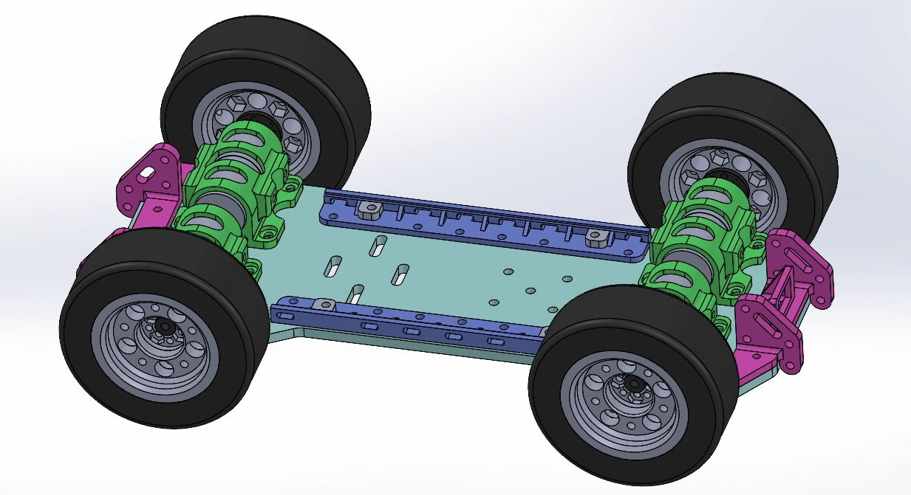

# Parametric CAD for 3D Printing
Master the fundamentals of 3D CAD by learning how to design and model custom parts for real-world applications. This course emphasizes practical techniques to effectively leverage rapid prototyping with 3D printing, enabling you to bring your ideas from concept to physical form quickly. By the end, you’ll have the skills to create precise, functional designs ready for fabrication.

Students are welcome to bring their own laptops. All students will be required to create a free account with onshape. Onshape is a cloud-based 3D CAD (Computer-Aided Design) platform used for product design, engineering, and collaboration. It is complete browser based. Onshape is similar to SolidWorks in it's workflow. 

**⭐Learning Goal**: Learn how to effectively design and model parts in 3D CAD to take full advantage of rapid prototyping with 3D printing.

We will walk through step-by-step to draw these parts. By the end of the course you will have all the complete 3D models to 3D print your own 4x4 mobile robot platform. *Lots of assembly required; but that's the fun part!*

## ✏️Design Examples (Mechanical Drawings) 
*(Use these drawings to create a 3D part!)*

1. [chassis_rev1](../files/chassis_robo_rover_rev1.pdf), [chassis_rev2](../files/chassis_robo_rover_rev2.pdf)
2. [shaft coupler](../files/motor_shaft_coupler_4mm.pdf)
3. [25mm motor](../files/gear_motor_12v_25mm.pdf)
4. [switch mount]()
5. [motor mount rev1](../files/gear_motor_mount_25mm_rev1.pdf), [motor mount rev2]()
7. [bumper]()
8. [wheel](), [tire]()
9. [rover assembly]()

## 🗳️CAD Models .3mf (3D print ready!) 
1. ~~[chassis_rev1]()~~, [chassis_rev2]()
2. [shaft coupler]()
3. [25mm motor]()
4. [switch mount]()
5. [motor mount rev1](), [motor mount rev2]()
6. [bumper]()
7. [wheel](), [tire]()
8. [rover assembly]()

### 💻 Software 
OnShape <https://www.onshape.com/en/>

### 🔩 Hardware/Fasteners for Assembly (BoM)
