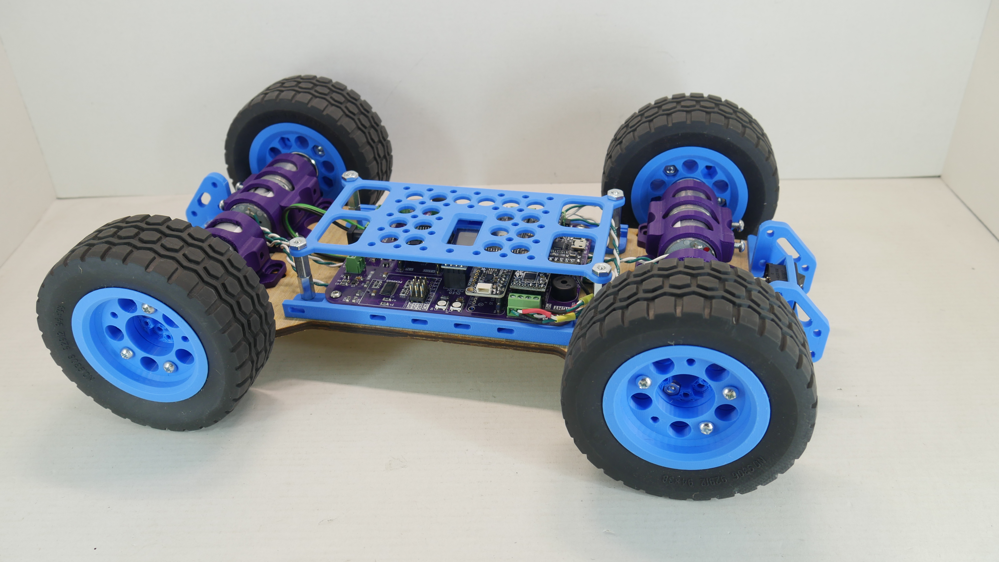
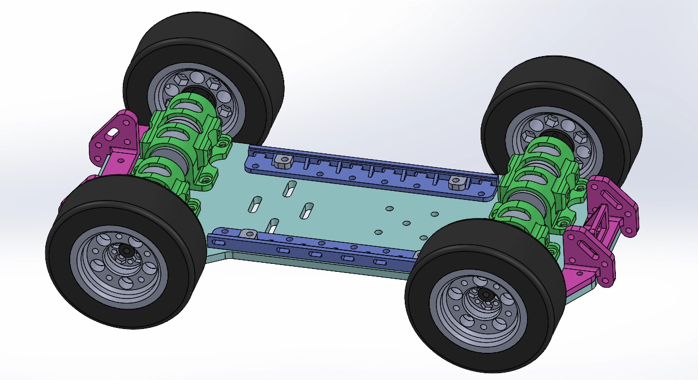

# Parametric CAD for 3D Printing
Learn how to design 3D-printable parts! Understand the fundamentals of 3D CAD by learning how to design and model custom parts for real-world applications. This course emphasizes practical techniques to effectively leverage rapid prototyping with 3D printing, enabling you to bring your ideas from concept to physical form quickly. By the end, you’ll have the skills to create precise, functional designs ready for fabrication. This is a dense, fast-paced course that requires prior computer literacy, including proficiency with mouse and keyboard operations, and a solid understanding of file and folder management within a Windows environment.

Students are welcome to bring their own laptops. All students will be required to create a free account with onshape.  **You will need access to your email account to verify creating a new account.** It is strongly recommended participants create a [free account](https://www.onshape.com/en/products/free) before attending class. Onshape is a cloud-based 3D CAD (Computer-Aided Design) platform used for product design, engineering, and collaboration. It is complete browser based. Onshape is similar to SolidWorks in it's workflow. 

**⭐Learning Goal**: Learn how to effectively design and model parts in 3D CAD to take full advantage of rapid prototyping with 3D printing.

 
  

Class will cover step-by-step instructions to draw these parts. By the end of the course you will have drawn all 3D models to 3D print your own 1:10 scale 4x4 mobile robot platform. *Lots of assembly required; but that's the fun part!*

## ✏️Design Examples (Mechanical Drawings) 
*(Use these drawings to create a 3D part!)*

1. [chassis_rev1](../files/chassis_robo_rover_rev1.pdf), [chassis_rev2](../files/chassis_robo_rover_rev2.pdf)
2. [shaft coupler](../files/motor_shaft_coupler_4mm.pdf)
3. [motor 25mm](../files/gear_motor_12_25mm_4mm_shaft.pdf)
4. [rear bumper](../files/rear_bumper.pdf)
5. [motor mount rev1](../files/gear_motor_mount_25mm_rev1.pdf), [motor mount rev2](../files/gear_motor_mount_25mm_rev2.pdf)
7. [switch mount](../files/switch_mount_bumper.pdf)
8. [rim](../files/rim.pdf), [tire](../files/tire_94x38.pdf)
9. [rover assembly](../files/rover_assy.pdf)

## 🗳️3D printable CAD Models (.3mf) 
1. ~~[chassis_rev1]()~~, [chassis_rev2](../files/chassis_robo_rover_rev2.3mf)
2. [shaft coupler](../files/shaft_coupler_4mm.3mf)
3. [25mm motor](../files/gear_motor_12v_25mm_4mm_shaft.3mf)
4. [rear bumper](../files/bumper_rear.3mf)
5. ~~[motor mount rev1]()~~, [motor mount rev2](../files/gear_motor_mount_25mm_rev2.3mf)
6. [front bumper](../files/bumper_front_switch_mount.3mf)
7. [rim](../files/wheel_rim.3mf), ~~[tire]()~~
8. [rover assembly]() .pending. *onshape export seems broken for assemblies?*

### 💻 Software 
OnShape <https://www.onshape.com/en/>

### 🔩 Hardware/Fasteners for Assembly (BoM)
| Item | Assembly     | Description                                | Qty | Cost   | Line Total | Vendor Link / McMaster Part#         |
|------|--------------|--------------------------------------------|-----|--------|------------|--------------------------------------------------------------------------------------|
| 1    | Wheel        | Lego "Compatible" Tire 94x38 (or similar)  | 1   | $17.65 | $17.65     | [Link](https://www.aliexpress.us/item/3256808684598937.html)                         |
| 2    | Drive        | Shaft Coupler, 4mm dia                     | 4   | $1.65  | $6.60      | [Link](https://www.aliexpress.us/item/3256805863207590.html)                         |
| 3    | Drive        | Motor 12V, 82 RPM                          | 4   | $5.74  | $22.96     | [Link](https://www.aliexpress.us/item/3256807500148966.html)                         |
| alt3 | Drive        | Motor 12V, 82 RPM + RC Wheel               | 4   | $6.46  | $25.84     | [Link](https://www.aliexpress.us/item/3256806026937992.html)                         |
| 5    | Chassis      | #6-32 x 0.5 in Round Head Screw            | 28  | $0.03  | $0.94      | 90279A148                                                                            |
| 6    | Chassis      | #6-32 x 0.75 in Round Head Screw           | 20  | $0.04  | $0.83      | 90279A151                                                                            |
| 7    | Chassis      | #6-32 nut                                  | 20  | $0.02  | $0.40      | 90480A007                                                                            |
| 8    | Chassis      | #6-32 nylon lock nut                       | 20  | $0.04  | $0.80      | 99397A622                                                                            |
| 9    | Chassis      | #6-32 x 1.0 in F/F Hex Standoff (optional) | 4   | $0.47  | $1.88      | 90480A005                                                                            |
| 10   | Wheel        | #4-40 x 0.5 in Round Head Screw            | 16  | $0.02  | $0.32      | 90272A110                                                                            |
| 11   | Wheel        | #4-40 nut                                  | 16  | $0.01  | $0.16      | 90480A005                                                                            |
| 12   | Wheel        | #4-40 lock nut (optional)                  | 16  | $0.03  | $0.48      | 90631A005                                                                            |
| 13   | On/Off switch | Switch, SPST                              | 1   | $0.71  | $0.71      | [Link](https://www.digikey.com/en/products/detail/e-switch/RA11131121/2720267)       |
|      |              |                                            |     |        | **$53.74** | Alternate hardware not included in total cost                                        |

### 🪫 Electronics (Control and Drive PCB)
*Links coming soon*  
~~Schematic + PCB (KiCAD design files)~~