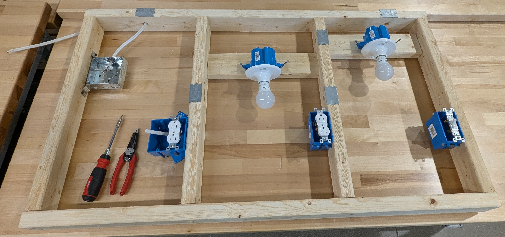

# Electrical Technician Basics

Electrical Technician Basics provides a foundational understanding of electrical concepts, safety practices, and tools used in the electrical technician trade. Participants will learn
essential terminology, basic electrical theory, and proper use of tools for measuring voltage, current, and resistance. Hands-on activities cover electrical safety and PPE, core electrical principles, reading simple electrical diagrams, correct use of hand and test tools, and wiring methods.

**⭐Learning Goal**: Hands-on approach to building and testing basic circuits—such as those found in your home (outlets, light fixtures, and two-way switches). Use electrical tools like wire strippers, multimeters, and DC power supplies, with practical repair examples. 

**Topics:**
- Safety and PPE
- Ohm’s Law, Series and Parallel Circuits
- Multimeter (measuring voltage, current, resistance, and continuity)
- DC Power Supplies 
- Wiring best practices
- Various electrical hand tools

### 📃 Useful docs
[Lecture Slides](/files/electrical_tech_slide_deck_rbates_april_2026.pdf)  
[Hands-on: Residential Circuit Diagram Examples](/files/residential_circuit_diagram_hands_on_examples.pdf) 

 