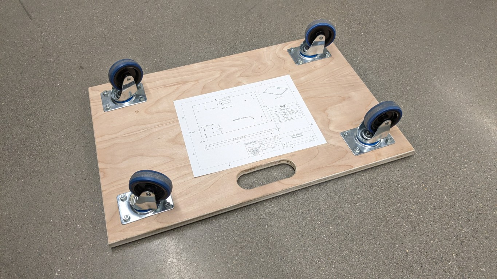

# Hand and Power Tools Basics

Hand & Power Tools Basics provides a foundational understanding of tools used for repair, maintenance, and light fabrication environments. Hands-on activities cover tool safety and PPE, proper tool selection, and correct use techniques through practical examples.

**⭐Learning Goal**: Gain experience and understanding of a few foundational hand and power tools by building a furnature dolley.

**Topics:**
- Safety and PPE
- Power drill
- Drill press
- Impact driver
- Track saw 
- Jigsaw and hand saws
- Tape measure & combination square
- Fasteners and drill bit types
- Measurement and thread standards
- Work holding methods
- Wrenches and various hand tools

### 📃 Useful docs
[Dolley Drawing](../files/moving_dolley_dimensioned.pdf)  
