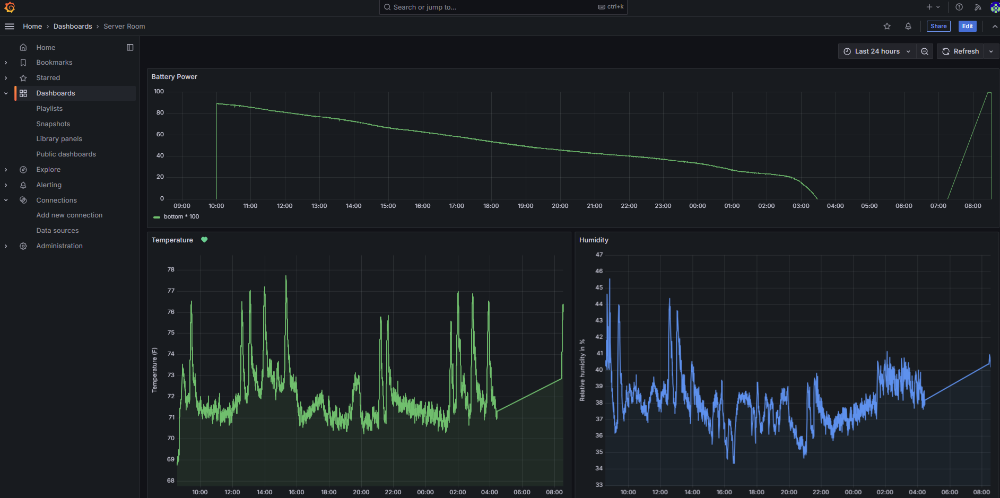
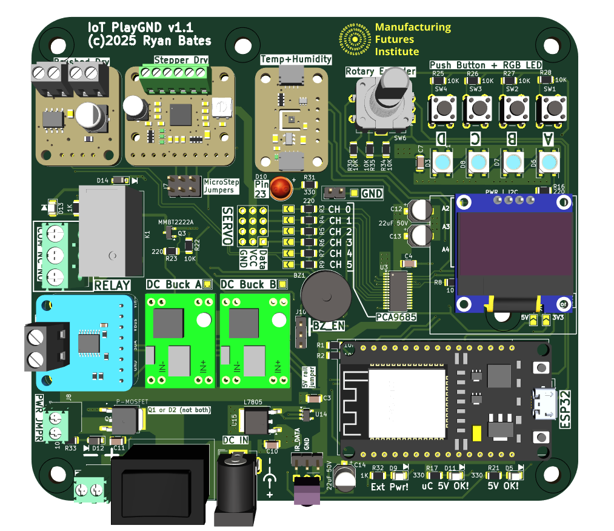

# IoT and Sensor Integration

Internet of Things + MQTT sensor, input, actuator, motor drive learning board. Can be powered with a power drill battery for immediate remote deployment and sensor monitoring.

Learning Goal: Quick start "how to" develop and build your own IIoT solution (with scale and affordability in mind) using off-the-shelf hardware and lightweight software.

## What is possible? ##
Deploy a temperature and humidity monitor for critical infrastructure (e.g., a server room). Send alerts or trigger actions if values fall outside the safe zone. In this example, the device was powered by a battery, which can also be monitored for scenarios where wired power is not available. A dashboard was built to display the data sent over MQTT.

## Hardware Summary

| Category       | Components                                                                 |
|----------------|----------------------------------------------------------------------------|
| **Microcontroller** | ESP32-WROOM-32                                                           |
| **Sensors/Input**         | - Temperature & Humidity (SHT45)   - Voltage, Current, Power (INA260)   - Pushbutton (x4)   - Rotary Encoder |
| **Actuators**       | - Relay (10A, 277VAC, 30VDC)   - DRV8871 (DC Motor Drive)   - A4988 (Stepper Motor Drive)   - 4 CH Servo (PCA9685) |
| **Output**          | - RGB LED (x4)   - OLED (128x64 pixel)   - Buzzer |

Use the links below to navigate source documents:

### 🔧 Hardware design files (circuit)
[Schematic.pdf](https://github.com/retrobuiltRyan/ESP32_IoT_PlayGND/blob/main/IoT%20PlayGND%20v1.1%20schematic.pdf)\
[KiCAD design files](https://github.com/retrobuiltRyan/ESP32_IoT_PlayGND)

### 💻Firmware (example codes)

1. [Blink](https://github.com/retrobuiltRyan/ESP32_IoT_PlayGND/blob/main/01_esp32_iot_plygnd_blink_gpio23.txt)
2. [Relay + PushButton](https://github.com/retrobuiltRyan/ESP32_IoT_PlayGND/blob/main/02_esp32_iot_playgnd_relay_pushbutton.txt)
3. [Buzer and PushButton](https://github.com/retrobuiltRyan/ESP32_IoT_PlayGND/blob/main/03_esp32_iot_playgnd_buzzer_pushbuttons.txt)
4. [RGB LEDs](https://github.com/retrobuiltRyan/ESP32_IoT_PlayGND/blob/main/04_esp32_iot_playgnd_neopixel.txt)
5. [RGB LEDs + Push Button](https://github.com/retrobuiltRyan/ESP32_IoT_PlayGND/blob/main/05_esp32_iot_playgnd_rgb_led_pushbuttons.txt)
6. [Rotary Encoder](https://github.com/retrobuiltRyan/ESP32_IoT_PlayGND/blob/main/06_esp32_iot_playgnd_rotary_encoder_neopixels.txt)
7. [DC Motor Drive](https://github.com/retrobuiltRyan/ESP32_IoT_PlayGND/blob/main/07_esp32_iot_playgnd_drv8871_dc_drive_pushbuttons.txt)
8. [Stepper Motor Drive](https://github.com/retrobuiltRyan/ESP32_IoT_PlayGND/blob/main/08_esp32_iot_playgnd_a4988_stepper_driver_pushbuttons.txt)
9. [Servo Multi Channel](https://github.com/retrobuiltRyan/ESP32_IoT_PlayGND/blob/main/09_esp32_iot_playgnd_pca9685_servo90.txt)
10. [i2c Sniffer](https://github.com/retrobuiltRyan/ESP32_IoT_PlayGND/blob/main/10_esp32_iot_playgnd_i2c_sniffer.txt)
11. [IR Remote Commands](https://github.com/retrobuiltRyan/ESP32_IoT_PlayGND/blob/main/11_esp32_iot_playgnd_ir_remote_oled.txt)
12. [Temp and Humidity](https://github.com/retrobuiltRyan/ESP32_IoT_PlayGND/blob/main/12_esp32_iot_playgnd_sht45_temp_humidity.txt)
13. [Voltage, Current Sense](https://github.com/retrobuiltRyan/ESP32_IoT_PlayGND/blob/main/13_esp32_iot_playgnd_ina260_vi_pwr_monitor.txt)
14. [MQTT + Sensor Data](https://github.com/retrobuiltRyan/ESP32_IoT_PlayGND/blob/main/14_esp32_iot_playgnd_mqtt_oled.txt)
15. [Bonus! Weather Forcast API + OLED](https://github.com/retrobuiltRyan/ESP32_IoT_PlayGND/blob/main/15_esp32_iot_playgnd_weather_forecast_api_oled.txt)

### 📃 Bill of Materials (parts needed)

| Reference                                                                 | Value                   | Qty | DigiKey P/N                     | Adafruit P/N | AliExpress / Amazon Link                                                                 |
|---------------------------------------------------------------------------|-------------------------|----:|---------------------------------|--------------|------------------------------------------------------------------------------------------|
| BZ1                                                                       | Buzzer_5V               |   1 | 445-2525-1-ND                   |              |                                                                                          |
| C3, C4, C7                                                                | 0.1uF 50V               |   3 | 1276-1068-1-ND                  |              |                                                                                          |
| C10, C11                                                                  | 0.22uF 50V CER          |   2 | 445-2283-1-ND                   |              |                                                                                          |
| C12, C13, C14                                                             | 22uF 50V                |   3 | 399-11438-1-ND                  |              |                                                                                          |
| D2                                                                        | D                       |   1 | S5AC-FDICT-ND                   |              |                                                                                          |
| D10                                                                       | LED                     |   1 | EALP05RDHRA2-ND                 |              |                                                                                          |
| D12                                                                       | SMF15A                  |   1 | SMF15A-E3-08CT-ND               |              |                                                                                          |
| D14                                                                       | 1N4148W                 |   1 | 4878-1N4148WCT-ND               |              |                                                                                          |
| J3                                                                        | ServoPort_04            |   1 | S1012EC-40-ND                   |              |                                                                                          |
| J5, J8                                                                    | Screw_Terminal_2_P3.50mm|   2 | 732-2747-ND                     |              |                                                                                          |
| J7                                                                        | PINHD_2x3_Male          |   1 | S1012EC-40-ND                   |              |                                                                                          |
| J15                                                                       | Screw_Terminal_3_P5.00mm|   1 | 277-1578-ND                     |              |                                                                                          |
| K1                                                                        | G5Q-1                   |   1 | Z2929-ND                        |              |                                                                                          |
| Q1                                                                        | MOSFET P-CH 30V 25A TO252|  1 | 785-1106-1-ND                   |              |                                                                                          |
| Q2, Q3                                                                    | MMBT2222A               |   2 | MMBT2222ATPMSCT-ND              |              |                                                                                          |
| R1, R2, R8, R22, R25, R26, R27, R28, R30, R34, R35, R36, R37, R38         | 10K                     |  14 | 311-10.0KFRCT-ND                |              |                                                                                          |
| R3, R4, R5, R6, R7, R9, R16, R23                                          | 220                     |   8 | 311-220FRCT-ND                  |              |                                                                                          |
| R17, R21, R31                                                             | 330                     |   3 | 311-330FRCT-ND                  |              |                                                                                          |
| R18, R19, R20, R32                                                        | 1K                      |   4 | 311-1.00KFRCT-ND                |              |                                                                                          |
| R33                                                                       | 100k                    |   1 | 311-100KFRCT-ND                 |              |                                                                                          |
| S1                                                                        | SPDT Switch             |   1 | EG5617-ND                       |              |                                                                                          |
| SW1, SW2, SW3, SW4                                                        | Push_Button             |   4 | 2223-TS02-66-60-BK-160-LCR-D-ND |              |                                                                                          |
| SW6                                                                       | RotaryEncoder_Switch_MP |   1 | PEC11R-4220F-S0024-ND           |              |                                                                                          |
| U3                                                                        | PCA9685PW               |   1 | 568-11925-1-ND                  |              |                                                                                          |
| U4                                                                        | SHT45                   |   1 |                                 | 6174         |                                                                                          |
| U7                                                                        | A4988                   |   1 |                                 | 6109         |                                                                                          |
| U8                                                                        | INA260                  |   1 |                                 | 4226         |                                                                                          |
| U14                                                                       | MAX40200AUK             |   1 | 175-MAX40203AUK+TCT-ND          |              |                                                                                          |
| U15                                                                       | L7805                   |   1 | 497-7255-1-ND                   |              |                                                                                          |
| U18, U19                                                                  | MP1584                  |   2 |                                 |              | [AliExpress Link](https://www.aliexpress.us/item/3256806890547813.html)                  |
| U21                                                                       | ESP32                   |   1 |                                 |              | [Amazon Link](https://www.amazon.com/gp/product/B0D8Q8XFRK/) _(beware pinout)_            |

### ✅ Hardware Fix List (PCB rev 1.1 -future-)

1. ~~The INA260 power sensor is upstream of the reverse polarity circuit(oops).~~  
   - ~~A reverse polarity event will damage the INA260.~~
   - ~~Need to moved INA260 circuit downstream of RPP.~~

2. ~~The stepper "Sleep" pin is not wired.~~
   - ~~Steppers with active code always consume power (holding torque).~~  
   - ~~No way to put them to sleep without a bodge wire on back of PCB.~~ 

3. Change ESP32 footprint to DigiKey p/n:  
   - `1965-ESP32-DEVKITC-32UE-ND` (reliable source).  
