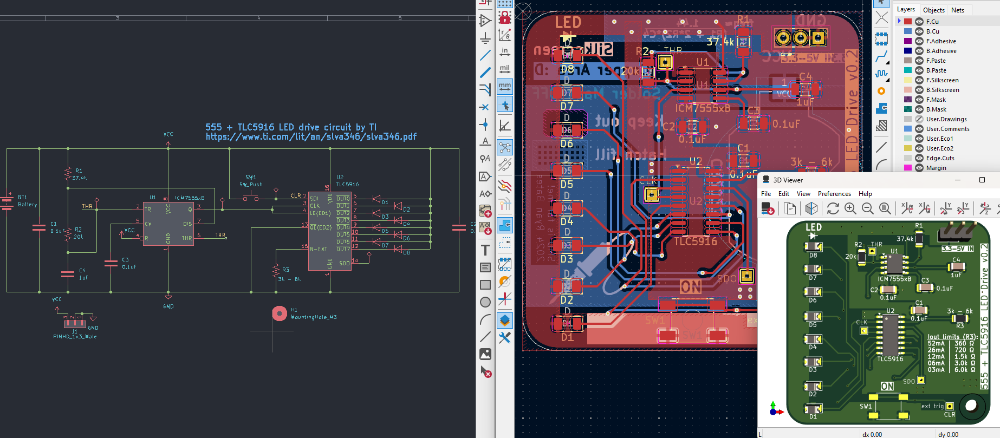
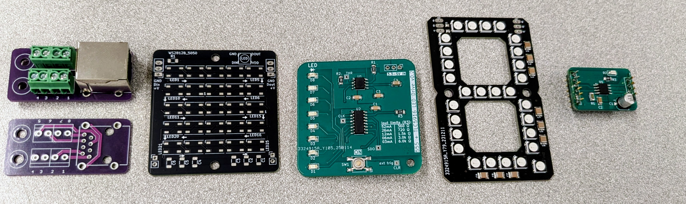

# PCB Design and Layout

Turn your idea into a ready-to-manufacture Printed Circuit Board (PCB) prototype in just one day with this hands-on course. Using the open-source KiCad software suite for Electronic Design Automation (EDA), you’ll learn how to create circuit schematics, design a 2-layer PCB, and generate Gerber and IPC-2581 outputs. By the end of the course, you’ll be able to capture a circuit schematic, design and route a circuit board layout, and understand 'some' key principles of good PCB design including an organized Bill of Materials (BoM). You’ll also explore custom part symbols, footprints, and fabrication resources, along with turn-key board manufacturers. *While a basic understanding of circuit theory and electrical fundamentals is helpful, it’s not required to get started.*

**⭐Learning Goal:** Quick start to design, layout, and order your own Printed Circuit Board with KiCAD.

## What is possible? 
 Start your prototypes on a PCB, or put your wiring project directly onto a PCB! Skip the confusion of breadboarding and the mess of point-to-point wiring. Learn EDA concepts to design and lay out a 2-layer printed circuit board.

### 💻 Software 
KiCAD <https://www.kicad.org/>

### 📐Practice Examples (Project Links)
1. [RJ-45 breakout](https://github.com/retrobuiltRyan/RJ-45-breakout)  
2. [RGB LED Matrix](https://github.com/retrobuiltRyan/5x5_RGBLED-Matrix)  
3. [555_Blink_a_tron](https://github.com/retrobuiltRyan/555_Blink-a-Tron)  
4. [DRV8871 DC Motor Driver](https://github.com/retrobuiltRyan/DRV8871_motor_driver)  
5. [neo7segment](https://github.com/retrobuiltRyan/Neo7Segment-Design-Files)  

In class, we use the above examples at approximately 80% completion. The projects above are fully complete, but in class we use these projects with 20% of the work unfinished to introduce core concepts in small doses within context. [This link](https://github.com/retrobuiltRyan/SMD_Slides/blob/main/PCB%20Teaching%20examples%20BACKUP.zip) contains projects 1-4 as partially incomplete examples with a "to-do" list embedded in each design document.  The layout scope expands with each near-complete project. The linked examples represent fully completed projects and are not reflective of the work explicitly covered in class with the instructor.

### 📃 Useful docs
[Lecture Slides](../files/pcb_design_and_layout_kicad_aug2025.pdf)  
[PCB Layout Tips](../files/pcb_design_tips.pdf) 

### 🔗 Helpful links, expanded learning
KiCAD learning <https://docs.kicad.org/>

#### Electronics Suppliers (Parts!):
Pro Suppliers (Distributors): [Digikey](http://Digikey.com), [Mouser](http://mouser.com), [Arrow](http://Arrow.com), [Newark](http://Newark.com) ,  
Hobby Suppliers [Adafruit](http://Adafruit.com), [Sparkfun](http://Sparkfun.com), [Pololu](http://Pololu.com)   